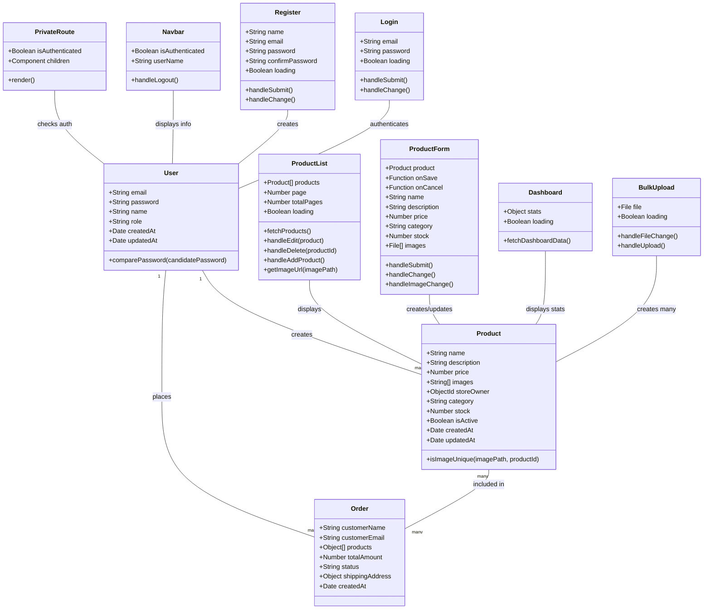

# E-Commerce Admin System Class Diagram

## Description

This class diagram represents the structure of the E-Commerce Admin System, including both backend models and frontend components.

### Backend Models
- **User**: Represents system users with authentication capabilities
- **Product**: Represents products in the system with various attributes
- **Order**: Represents customer orders with product references

### Frontend Components
- **Login/Register**: Authentication components
- **ProductList/ProductForm**: Product management components
- **Dashboard**: Overview of system statistics
- **BulkUpload**: Mass product creation component
- **Navbar**: Navigation component
- **PrivateRoute**: Authentication protection component

### Relationships
- Users create Products (one-to-many)
- Products are included in Orders (many-to-many)
- Users place Orders (one-to-many)
- Frontend components interact with backend models through API calls 